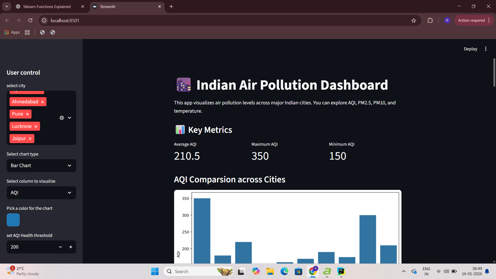
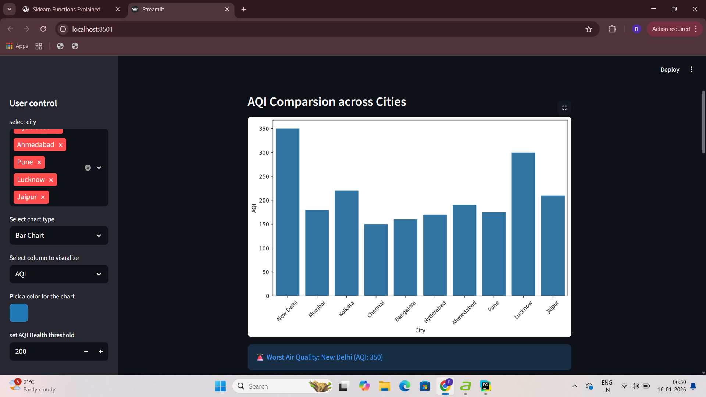
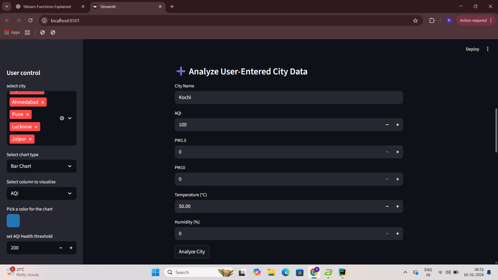
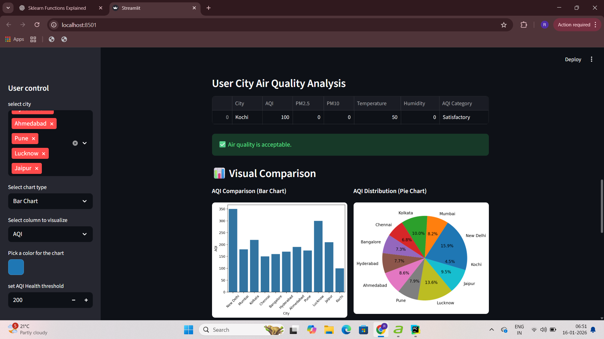
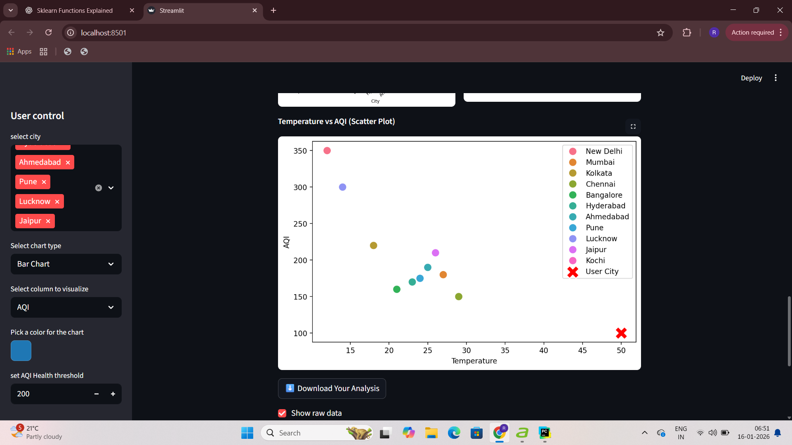

# 🌆 Indian Air Pollution Analysis Dashboard

An interactive **Streamlit web application** to analyze and visualize air pollution data across major Indian cities.  
The dashboard allows users to explore AQI trends, compare pollutants, analyze health impacts, and even **enter their own city data** for instant analysis and visualization.

---

## 📌 Project Overview

Air pollution is a major environmental and health concern in India.  
This project aims to:

- Analyze air quality data (AQI, PM2.5, PM10, Temperature, Humidity)
- Provide clear visual insights using graphs
- Classify air quality into health categories
- Allow **user-entered city data analysis**
- Enable **comparison between user data and existing cities**
- Support **data download for further analysis**

---

## 🚀 Features

### ✅ City-Based Analysis
- Select one or multiple cities from the sidebar
- Filter data dynamically
- View best and worst air quality cities

### 📊 Visualizations
- **Bar Chart** – Compare AQI or pollutants across cities
- **Pie Chart** – Show proportion of pollution contribution
- **Scatter Plot** – Relationship between Temperature and AQI

### 🏥 AQI Health Categorization
Air Quality Index is classified as:
- Good (0–50)
- Satisfactory (51–100)
- Moderate (101–200)
- Poor (201–300)
- Very Poor (301–400)
- Severe (401–500)

### ➕ User Input Analysis
- Enter your own city details:
  - AQI
  - PM2.5
  - PM10
  - Temperature
  - Humidity
- Instantly get:
  - AQI category
  - Health warning status
  - Visual comparison graphs

### 📈 Key Metrics
- Average AQI
- Maximum AQI
- Minimum AQI

### ⬇️ Data Download
- Download filtered dataset
- Download user-entered analysis as CSV

---

## 🛠️ Technologies Used

- **Python**
- **Streamlit** – Web app framework
- **Pandas** – Data manipulation
- **Matplotlib & Seaborn** – Data visualization

---

